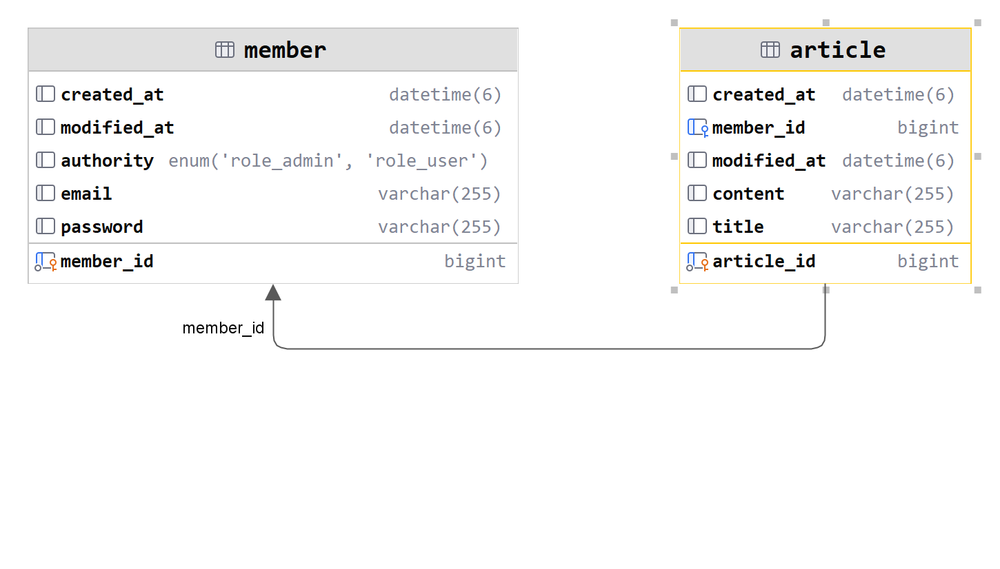
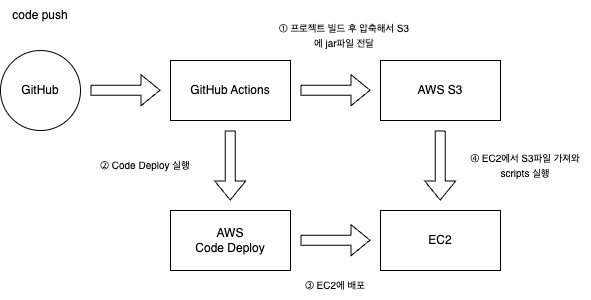

## wanted-pre-onboarding-backend

### 지원자: 정현석

### 애플리케이셜 실행 방법

1. 레포지토리 클론
2. application.yml 작성 `src/main/resources/application.yml`

    ```yaml
    spring:
      datasource:
        driver-class-name: com.mysql.cj.jdbc.Driver
        url: jdbc:mysql:{{DB_URL}}
        username: {{DB_USER}}
        password: {{DB_PASSWORD}}
      jpa:
        show-sql: true
        properties:
          hibernate:
            format_sql: true
        hibernate:
          ddl-auto: update
    jwt:
      secret: {{JWT_SECRET}}
    ```
3. 실행

    ```shell
    ./gradlew bootrun
    ```

## 데이터베이스 테이블 구조



## 구현한 API의 동작을 촬영한 데모 영상 링크

[YouTube](https://youtu.be/MD3x4-HmDXc)

## 구현 방법 및 이유에 대한 간략한 설명

- Github Actions를 이용한 CICD 구현 후 기능 개발
- 사용자와 게시글을 일대다 관계로 구현
- 게시글 수정 및 삭제시 권한 확인을 위해 Spring Security와 jWt Token을 사용

## API 명세(request/response 포함)

[Postman Docs](https://documenter.getpostman.com/view/27919070/2s9XxyRDFz)

## 클라우드 환경 (AWS)에 배포



- [Health Check](http://43.201.13.161:8080/health)
- [Postman Docs](https://documenter.getpostman.com/view/27919070/2s9XxyRDFz)

